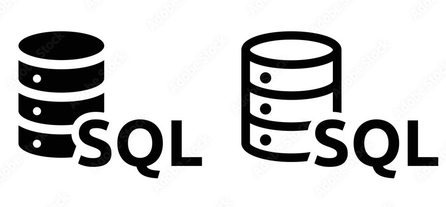

# **Curso de SQL desde Cero - 6 Horas** 🛢️



## **Descripción**

Este repositorio contiene todo el material necesario para el curso intensivo de **SQL desde cero**, tiene una duración de **6 horas**. El curso está orientado a principiantes y cubre los aspectos básicos del lenguaje SQL, incluyendo consultas simples, manipulación de datos, relaciones entre tablas y funciones agregadas.

## **Estructura del Curso**

El curso está dividido en **6 módulos** teóricos y prácticos. Cada módulo incluye ejemplos para afianzar los conceptos.

### **Módulos:**
1. **Introducción a las Bases de Datos y SQL**
   - Conceptos de bases de datos relacionales.
   - Introducción a SQL.
   - Instalación de PostgreSQL

2. **Manipulación de Datos (CREATE, INSERT, UPDATE, DELETE)**
   - Creación de tablas con `CREATE`
   - Inserción de registros con `INSERT INTO`.
   - Actualización de datos con `UPDATE`.
   - Eliminación de registros con `DELETE`.

3. **Consultas Básicas (SELECT)**
   - Sintaxis básica de `SELECT`.
   - Filtrado de resultados con `WHERE`.
   - Ordenación de datos con `ORDER BY`.

4. **Operaciones con Múltiples Tablas (JOIN)**
   - Uso de subqueries.
   - Uso de `INNER JOIN`, `LEFT JOIN` y `RIGHT JOIN`.

5. **Funciones Agregadas y Agrupamiento (GROUP BY)**
   - Funciones agregadas (`COUNT()`, `SUM()`, `AVG()`).
   - Agrupación de resultados con `GROUP BY`.
   - Filtrado de grupos con `HAVING`.

6. **Relaciones entre tablas**
   - Primary key y foreign key
   - Relación uno a uno (1-1)
   - Relación uno a muchos (1-N)
   - Relación muchos a muchos (N-N)

## **Requisitos**

Antes de comenzar, asegúrate de tener los siguientes requisitos:

- **PostgreSQL** o cualquier otro sistema de bases de datos relacional compatible con SQL.

## **Instrucciones de Instalación**

1. **Clonar el repositorio:**

   ```bash
   git clone https://github.com/tuusuario/curso-sql-desde-cero.git
